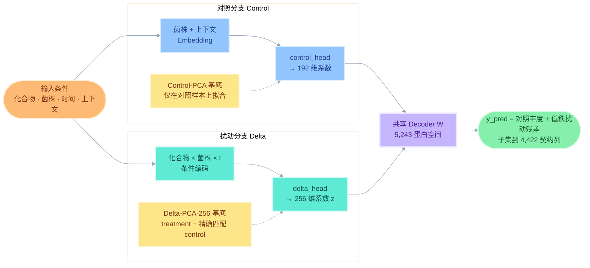
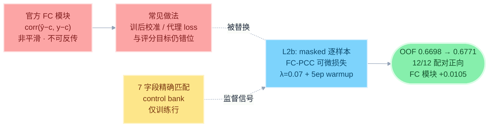
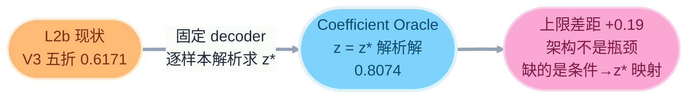
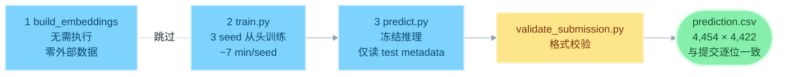

# GOAI Virtual Yeast｜虚拟酵母扰动蛋白组预测

<p align="center">
  <b>从初赛可信低秩基线，到复赛评分对齐与多 seed 稳健集成</b><br>
  给定化合物、菌株、时间与培养条件，预测酵母全蛋白组响应。
</p>

<p align="center">
  
  
  
  
  
</p>

<p align="center">
  
  
  
  
  
</p>

<p align="center">
  
</p>

---

## 项目一句话

**GOAI Virtual Yeast** 是一个面向 GOAI「前沿探索 AI for Research」虚拟细胞赛道的酵母扰动蛋白组响应预测项目。

模型根据**化合物 × 菌株 × 时间 × 培养上下文**，预测 4,454 个测试样本的蛋白质组 log2 丰度。模型内部学习完整的 **5,243 维蛋白空间**，正式提交输出 **4,422 个官方契约蛋白**。

核心模型 **L2b** 将细胞响应分解为：

> **预测蛋白组 = 对照状态 + 低秩扰动响应**

在此基础上，我们把官方评分中的逐样本 **FC-PCC** 指标转化为可微训练损失，使训练目标直接对齐评测目标。本地四折三 seed OOF proxy 从 **0.6698 提升至 0.6771**，12 个 seed×fold 配对结果全部提升。

> `0.6771` 为本地 OOF 六模块 proxy，不是官方测试集成绩。

---

## 从初赛到复赛：模型如何完成升级

| 阶段   | 初赛：可信低秩基线                    | 复赛：L2b 评分对齐模型               |
| ---- | ---------------------------- | --------------------------- |
| 核心目标 | 建立无测试泄漏的高维蛋白预测体系             | 提升评分一致性与跨随机种子稳定性            |
| 模型结构 | Control-Anchored Low-Rank V5 | C2-r256 + 可微 FC-PCC         |
| 蛋白空间 | 内部预测 5,243 维                 | 内部 5,243 维，提交 4,422 契约列     |
| 扰动建模 | 对照状态 + Delta-PCA 低秩残差        | 保留低秩结构，直接优化 FC 方向相关性        |
| 验证方式 | 4 折 LOSO 菌株外推                | V2 四折 × 3 seed + V3 化合物分组五折 |
| 数据治理 | NaN-aware、测试标签硬隔离            | 修复索引错位、重训全部受影响实验            |
| 集成策略 | 单模型/基础集成                     | seed 42、2026、3407 等权集成      |
| 本地结果 | C2 基线 0.6698                 | **L2b 0.6771，提升 +0.0073**   |
| 稳健性  | 建立可用基线                       | **12/12 配对提升，FC +0.0105**   |

初赛解决的是“**能否可信地预测**”；复赛进一步解决的是“**如何让模型直接学习官方真正关心的扰动方向，并证明增益不是随机波动**”。

---

## 复赛的三项核心升级

### 1. 从绝对丰度预测升级为生物过程分解

模型不直接用一个黑盒网络输出数千个蛋白，而是将细胞状态拆分为：


* **Control 分支**预测菌株在对应培养条件下的基础蛋白状态；
* **Delta 分支**预测化合物造成的低秩扰动；
* Delta-PCA 在 treatment − matched control 上拟合，使模型聚焦真正的扰动响应。

这种结构更符合生物实验逻辑，也降低了“小样本预测数千蛋白”带来的过拟合风险。

### 2. 从训练后评分升级为可微评分对齐

官方 FC 模块关注预测扰动方向与真实扰动方向的相关性，而普通 MSE 更关注逐点数值误差，两者并不完全一致。

复赛模型加入逐样本 masked FC-PCC 损失：


最终采用 `λfc = 0.07` 和 5 epoch warmup，在不牺牲 absolute 模块的情况下，使 FC 平均提升 **+0.0105**。

### 3. 从单次高分升级为可审计的稳健结果

复赛不依赖单个随机种子或单个验证折：

* 3 个随机种子：42、2026、3407；
* 4 个 LOSO folds；
* 共 12 个严格同 seed 配对单元；
* **12/12 proxy 全部提升**；
* 三 seed 等权融合，不搜索测试权重；
* checkpoint 仅按训练损失选择，不使用验证分数挑选 epoch。

最终结果不是一次偶然高分，而是跨 fold、跨 seed 一致的稳定改进。

---

## 核心结果

| 指标                     |  C2 基线 |                      复赛 L2b |           改进 |
| ---------------------- | -----: | --------------------------: | -----------: |
| 本地 V2 三 seed OOF proxy | 0.6698 |                  **0.6771** |  **+0.0073** |
| 配对提升单元                 |      — |                 **12 / 12** |         全部正向 |
| FC 模块                  |      — |                           — |  **+0.0105** |
| 单 seed Δproxy          |      — | +0.0081 / +0.0080 / +0.0067 | 无明显 seed 敏感性 |
| 三 seed 测试预测 PCC        |      — |               0.9988–0.9990 |         高一致性 |

我们的主要优势并不是堆叠更多外部特征，而是：

1. **结构合理**：用“对照状态 + 扰动残差”表达细胞响应；
2. **目标一致**：训练损失直接对齐官方 FC 评分；
3. **结果稳健**：12/12 配对提升，三 seed 一致；
4. **数据可信**：测试标签从加载层硬隔离；
5. **完整可复现**：配置、数据索引、预测与 checkpoint 均有 SHA256 审计。

---

## 科学审计：为什么最终模型没有继续堆外部数据

复赛阶段，我们系统审计了 ChEMBL 靶点、Alliance 同源映射、STRING 网络与序列嵌入、Dryad HIP/HOP、分子结构、latent teacher 和场景校准等 8 个方向。

所有实验均采用统一标准：

> **预注册晋级门槛 → shuffle/截距/零特征对照 → 独立重初始化 → 配对统计检验 → 不通过立即冻结**

部分外部数据确实包含统计信号，但覆盖不足或无法稳定迁移到本任务；强行接入反而造成过拟合。因此最终提交保持**零外部数据依赖**。

这不是简单的“没有使用外部数据”，而是经过系统验证后选择了信息密度更高、证据更可靠的模型路径。

---

> **仓库定位：初赛低秩基线 + 复赛评分对齐模型 + 双验证协议 + 三 seed 完整复现 + 外部数据负结果审计链。**

## 1. 关键信息速查

| 项              | 值                                                                             |
| -------------- | ----------------------------------------------------------------------------- |
| 最终模型           | **L2b** — ControlAnchoredLowRankModelV5B (C2-r256 + 可微逐样本 FC-PCC, λ\_fc=0.07) |
| 集成方式           | 3 seed (42/2026/3407) 等权 full-data refit（预固定规则，无权重搜索）                         |
| 本地验证           | V2 四折 LOSO × 3-seed OOF **0.6771**（C2 基线 0.6698，Δ+0.0073，12/12 配对正向）          |
| V3 外推协议        | 化合物分组五折 0.6171（S1 未见化合物 = 0.474，定位瓶颈）                                         |
| Oracle 上限      | coefficient oracle 0.8074（+0.19，架构非瓶颈的机制证明）                                   |
| prediction.csv | 4,454 × (sample\_ID + 4,422)，log2，SHA256 `db113d3e…`（完整值见 §6）                 |
| 外部数据           | **零依赖**（8 方向审计后全部弃用，审计链保留）                                                    |
| 许可证            | MIT（`LICENSES/`）                                                              |

***

## 2. 总体架构：Control-Anchored 低秩分解



模型的核心思想：**绝对丰度由对照分支解释，扰动响应由低秩分支解释**。Delta-PCA 基底在「treatment − 精确匹配 control」的 Δ 矩阵上拟合，天然聚焦评分所关心的相对响应；全链路 NaN-aware（observed mask 参与所有损失）。

***

## 3. 核心创新：可微评分对齐（L2b）



**相对已有方法新在哪里**：不是训后校准，也不是代理 loss 近似，而是把评分器的非平滑统计量直接嵌入训练循环，并证明其对多 seed 稳健（三 seed Δproxy 分别 +0.0081 / +0.0080 / +0.0067）。单一可微 FC-PCC 项贡献的 +0.0073 超过所有外部特征方向之和。

***

## 4. 验证与审计体系

### 4.1 双验证协议

| 体系                  | 设计                   | 检验目标     | L2b              |
| ------------------- | -------------------- | -------- | ---------------- |
| V2 四折 LOSO × 3 seed | query 菌株 seen-化合物进训练 | 菌株/总体稳健性 | **0.6771**       |
| V3 五折化合物分组          | query 菌株处理样本零进训练     | 未见化合物外推  | 0.6171（S1=0.474） |

### 4.2 Oracle 上限审计：瓶颈定位



后续蒸馏实验（L9A/B/C）证明 z\* 中可从条件预测的成分已被主干捕获，剩余为样本特异——**距 0.70 的 +0.023 缺口属于科学问题（需要任务贴近的新扰动数据），不属于调参**。这统一解释了下面全部 8 个负结果。

### 4.3 外部数据负结果链（8 方向统一范式审计）

| 方向                          | 判定证据（全部冻结）                                 |
| --------------------------- | ------------------------------------------ |
| ChEMBL 靶点 + Alliance 同源（L5） | 增益 100% 来自截距（intercept-only 消融差 1e-8）      |
| Dryad HIP/HOP kNN（L6）       | 信号真实（shuffle 归零）但 16 化合物池天花板：+0.0005       |
| 分子结构 → HIP（L7/L10）          | scaffold 严格复核后真实信号 +0.05（p=0.0001），下游净效应为负 |
| STRING 网络 / 序列嵌入（L4）        | Δproxy +0.0006，远低于门槛                       |
| latent teacher 蒸馏（L9）       | 增益为初始化伪影（独立重初始化后消失，−0.010）                 |
| Mean-Delta / 场景校准           | 折间不稳定 / cross-fitted α 折间 0.31–1.17        |

**核心结论：可预测性 ≠ 可用性**——外部信号可以统计真实但「太稀薄」，无法克服旁路过拟合。完整决策文档 + JSON 存档随包分发，供社区复用。

### 4.4 数据完整性工程

* **INDEX MISALIGNMENT 审计**：发现早期 split 生成的索引语义错位（每折 \~1,500 行验证数据混入训练），完成根因定位 → 调用链逐文件判定 → 受污染实验全量重训 → 双验证协议重建；

* **评分器独立审计**：从官方公式独立重写六模块评分器，与主评分器在全部 OOF 预测上逐位一致（max |Δ| = 1.11e-16）；

* **防覆盖机制**：每折 run\_manifest（config SHA + sample\_id SHA）一致才复用、不一致立即停止。

***

## 5. 复现流程：三条主命令



```bash
# 1) 构建外部特征/embedding —— 最终模型不使用外部数据, 无需执行
python scripts/build_embeddings.py

# 2) 从头训练最终模型 (3 seed, 等权集成成员)
python scripts/train.py --metadata <train_val_metadata.csv> \
    --proteome <train_val_proteome.csv> \
    --test-metadata <test_metadata.csv> \
    --config configs/final.yaml --output-dir runs/final

# 3) 冻结模型推理并生成 prediction.csv (仅读 test metadata, 不读测试表型)
python scripts/predict.py --metadata <test_metadata.csv> \
    --train-metadata <train_val_metadata.csv> \
    --train-proteome <train_val_proteome.csv> \
    --run-dir runs/final --output prediction.csv

# 附加) 提交前格式校验
python scripts/validate_submission.py --prediction prediction.csv \
    --test-metadata <test_metadata.csv>
```

备选：把官方文件放入 `input/` 目录（train\_val metadata/proteome + test metadata）可省略显式路径参数。训练需要 test metadata 仅用于构建 train+test **联合实体词表**（编码索引与 checkpoint 维度一致），**不读取任何测试表型**——数据加载器默认 `allow_test_labels=False` 硬隔离。

<details>
<summary><b>环境要求</b>（点击展开）</summary>

* Python ≥ 3.10, PyTorch ≥ 2.0（CUDA 可选，CPU 可运行但较慢）

* `pip install -r requirements.txt`

* 资源：GPU 显存 \~6GB；训练 \~7 min/seed（RTX 4060）；推理 \~2 min；磁盘 \~2GB

</details>

<details>
<summary><b>数据与预处理契约</b>（点击展开）</summary>

* 以 `sample_ID` 为唯一键对齐 metadata 与 proteome（不依赖 CSV 行顺序）

* log2 仅对有限且 >0 的原始强度；NaN 保留为 mask，不解释为 0

* 缺失填充仅用 train 列中位数；**特征契约 4,422 蛋白**由 `split_final=='train'` 行缺失率 <80% 决定（`artifacts/feature_contract.json` 含 SHA256）

* 模型内部用全 5,243 列训练，输出子集到契约列（值与全空间预测逐位一致）

* 全部统计量（control bank / 中位数 / PCA 基底 / 词表）仅由 train 行拟合

</details>

***

## 6. prediction.csv 获取

`prediction.csv`（193 MB）超出 GitHub 单文件 100 MB 限制，**不随 git 仓库分发**（官方提交说明允许「稳定下载链接 + SHA256」）。获取方式三选一，结果与正式提交逐位一致：

| 方式             | 说明                                                    |
| -------------- | ----------------------------------------------------- |
| **提交包**        | 官方提交附件 `AI4R_AIVC_GOAI_Virtual_Yeast_代码材料.zip` 内含完整文件 |
| **重新生成**（推荐）   | 运行 §5 命令 2 + 3，输出 SHA256 应等于下表值（同硬件逐位一致）              |
| **Release 附件** | 本仓库 Release `v1.0-semifinal` 附带（上传后可用）                |

**核对值**：`db113d3ecad727a560ebad69aa18667035ff8af059639881189be9c5cdcb8f0f`

跨硬件时存在浮点级差异（CUDA 非确定性归约），以 manifest 中 per-seed ensemble SHA 与 proxy 复核为准。

***

## 7. 目录结构

```text
GOAI-Virtual-Yeast-Semifinal/
├── README.md                          # 本文件
└── VC_GOAI_Virtual_Yeast_reproduction/
    ├── README.md                      # 复现包主说明（首页信息表 + 训练细节）
    ├── requirements.txt
    ├── configs/final.yaml             # 冻结配置
    ├── prediction.csv                 # ⚠️ 不入 git（见 §6 获取方式）
    ├── REPRODUCIBILITY_MANIFEST.json  # 全包清单 + 逐文件 SHA256
    ├── src/                           # 数据 / 模型 / 损失 / 评分 / 训练组件
    │   ├── data_processor_v5.py       # 便携性补丁版（数学不变）
    │   ├── model_v5.py / model_v5b.py # 模型定义
    │   ├── losses_v5.py               # masked huber / PCC loss
    │   ├── scoring_official_v5b.py    # control bank（7 字段精确匹配）
    │   └── train_components.py        # delta-PCA / FC-cache / FC loss
    ├── scripts/
    │   ├── build_embeddings.py        # no-op（零外部数据）
    │   ├── train.py                   # 命令 2：从头训练
    │   ├── predict.py                 # 命令 3：推理 + prediction.csv
    │   └── validate_submission.py     # 格式校验
    ├── checkpoints/                   # 3 seed checkpoint + manifest
    ├── artifacts/                     # 特征契约 + prediction manifest
    ├── external_data/                 # 声明：无外部数据
    ├── tests/test_smoke.py            # 冒烟测试
    └── LICENSES/
```

***

## 8. 已知限制

1. 模型内部使用 5,243 蛋白列，prediction 输出时子集到 4,422 契约列（对评分无影响，完整披露见复现包 README §3）
2. 跨硬件复现存在浮点级差异，预期 Δproxy < 0.001（3 seed 平均进一步压低方差）
3. checkpoint 为 full-data refit（8,958 行全部拟合）；0.6771 为 V2 四折 OOF 本地 proxy，非测试分数
4. 提交冻结后的追加审计（checkpoint soup +0.0013 / 分组均衡训练 −0.0036 / 组级 latent teacher 差距不足）均按同范式冻结，未切换提交

***

## 9. 可复用资产

* 可微 FC-PCC 评分对齐实现（`src/losses_v5.py` + `train_components.py`）

* NaN-aware 低秩分解架构（`src/model_v5.py`）

* 双验证 split 协议（V2 LOSO / V3 化合物分组）

* Oracle 上限审计思路（固定 decoder 解析求 z\*）

* 8 方向负结果决策文档 + JSON（REPRODUCIBILITY\_MANIFEST.json → negative\_results）

* 对照实验设计三层方法论：shuffle 保留增益 ≠ 信号有效 / 对照须独立重初始化 / 高相关空间须报告 real−shuffle 增量

***

## 10. License

MIT License. See `VC_GOAI_Virtual_Yeast_reproduction/LICENSES/` for details.
